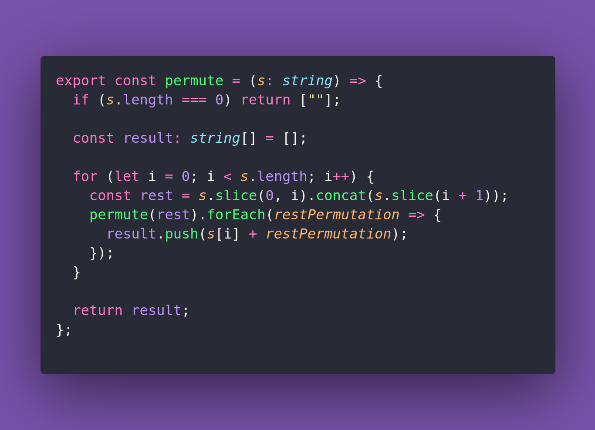

# 🌱 Permute

Interview question of the [issue #386 of rendezvous with cassidoo](https://buttondown.com/cassidoo/archive/the-beginning-is-the-most-important-part-of-the/).

## The Question

Write a function that generates all possible permutations of a given string.

### Example

```js
permute('abc')
> ['abc', 'acb', 'bac', 'bca', 'cab', 'cba']
```

## Solution


