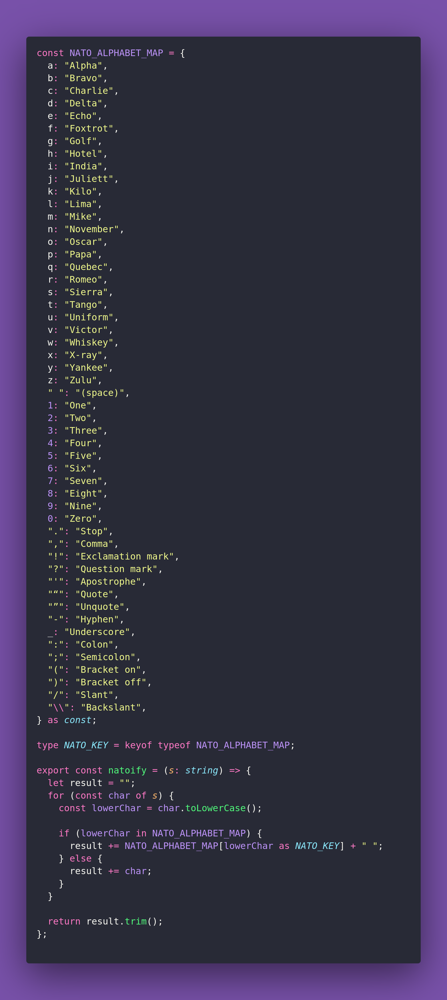

# 🌱 Permute

Interview question of the [issue #387 of rendezvous with cassidoo](https://buttondown.com/cassidoo/archive/believe-in-the-power-of-your-own-voice-al-gore/).

## The Question

Make a translation function for the [NATO phonetic alphabet](https://en.wikipedia.org/wiki/NATO_phonetic_alphabet?utm_source=cassidoo&utm_medium=email&utm_campaign=believe-in-the-power-of-your-own-voice-al-gore).
Extra credit: Get creative with the variants!

### Example

```js
> natoify('hello world')
> "Hotel Echo Lima Lima Oscar (space) Whiskey Oscar Romeo Lima Delta"

> natoify('3spooky5me')
> "Three Sierra Papa Oscar Oscar Kilo Yankee Five Mike Echo"
```

## Solution


