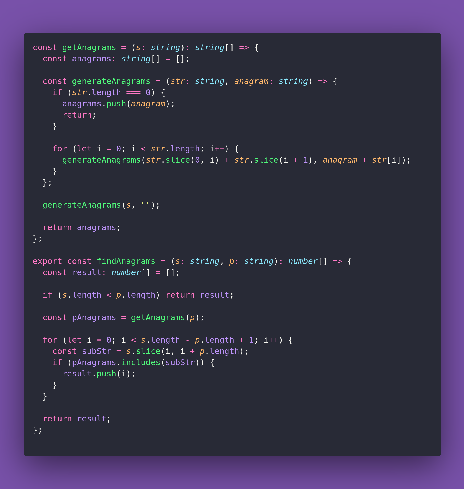

# 📘 Find Anagrams

Interview question of the [issue #389 of rendezvous with cassidoo](https://buttondown.com/cassidoo/archive/if-you-are-interested-in-what-you-do-that-keeps/).

## The Question

Given two strings, s and p, return an array of all the start indices of p's anagrams in s.

### Example

```js
findAnagrams("cbaebabacd", "abc")
> [0, 6]

findAnagrams("fish", "cake")
> []

findAnagrams("abab", "ab")
> [0, 1, 2]
```

## Solution


