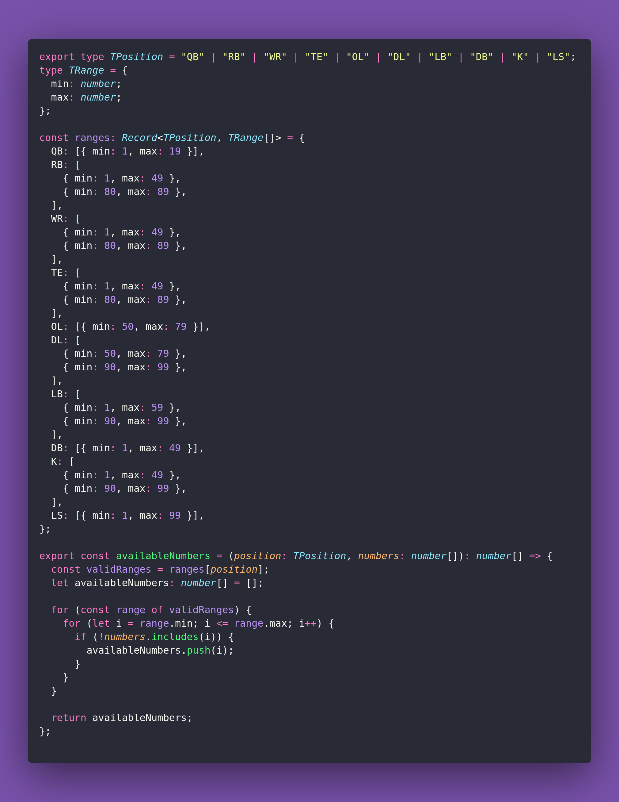

# 🦅 Available Numbers

Interview question of the [issue #391 of rendezvous with cassidoo](https://buttondown.com/cassidoo/archive/the-world-is-a-museum-of-other-peoples-passion/).

## The Question

Given the current system of NFL uniform numbers, a given player's position,
and an array of existing numbers on the team, write a function that returns a list of numbers that
the given player can choose from for their uniform.

### Example

```js
> availableNumbers("QB", [1, 2, 3, 10, 19])
> [4, 5, 6, 7, 8, 9, 11, 12, 13, 14, 15, 16, 17, 18]
```

## Solution


