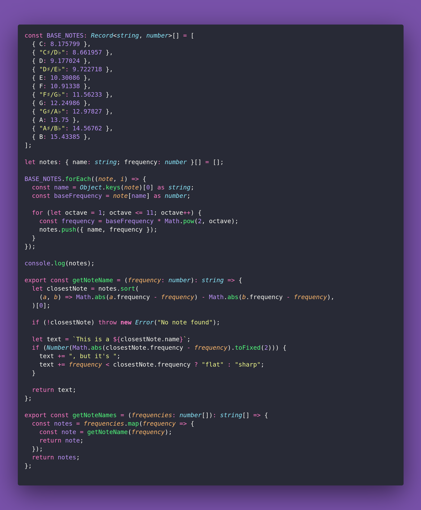

# 🎶 Get Note Name

Interview question of the [issue #393 of rendezvous with cassidoo](https://buttondown.com/cassidoo/archive/we-must-choose-kind-words-that-lift-people-up/).

## The Question

Given a list of frequencies (in Hz), write a function to determine the closest musical note for
each frequency based on the A440 pitch standard.

Extra credit: indicate if the note is flat or sharp!

### Example

```js
> getNoteNames([440, 490, 524, 293.66])
> ["This is a A", "This is a B, but it's flat", "This is a C, but it's sharp", "This is a D"]
```

## Solution


