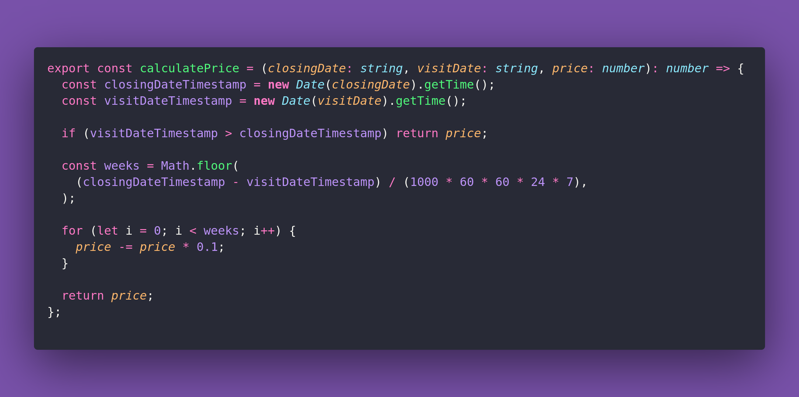

# 🪁 Calculate Price

Interview question of the [issue #394 of rendezvous with cassidoo](https://buttondown.com/cassidoo/archive/if-you-always-do-what-interests-you-at-least-one/).

## The Question

A store is going out of business and will reduce the price of all products by 10% every week
leading up to the closing date. Given the closingDate, visitDate, and the originalPrice of a
product, write a function that returns the price of the product on the visitDate.

You can assume that originalPrice is a positive number.

### Example

```js
calculatePrice('2025-04-01', '2025-03-03', 100); // 4 weeks of discounts
> 65.61
calculatePrice('2025-04-01', '2025-03-15', 50);  // 2 weeks of discounts
> 40.5
calculatePrice('2025-04-01', '2025-04-15', 75);  // No discount (visit after closing)
> 75
```

## Solution


