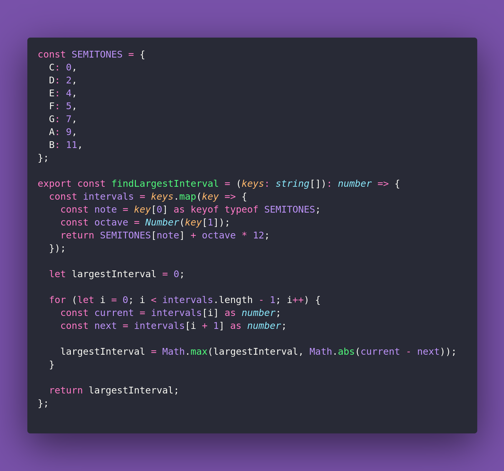

# 🚏 Find Largest Interval

Interview question of the [issue #395 of rendezvous with cassidoo](https://buttondown.com/cassidoo/archive/if-youre-going-to-go-for-a-thing-theres-no-point/).

## The Question

Write a function that takes a list of piano keys played in sequence and returns the largest
interval (in semitones) between any two consecutive keys.

Assume the lowest note is A0, and the highest is C8.

### Example

```js
> findLargestInterval(['A0', 'C1', 'G1', 'C2'])
> 7

> findLargestInterval(['C4', 'G4', 'C5', 'G3'])
> 17

> findLargestInterval(['E2', 'C3', 'G3', 'C8'])
> 53
```

## Solution


