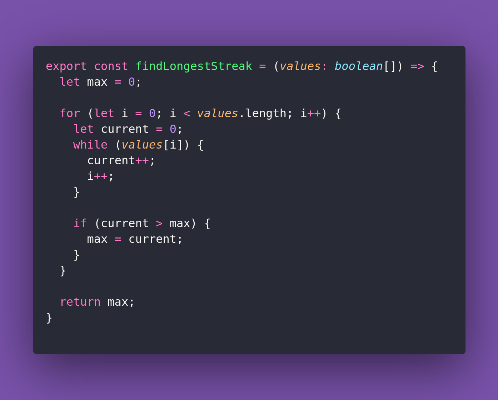

# 📟 Find Longest Streak

Interview question of the [issue #397 of rendezvous with cassidoo](https://buttondown.com/cassidoo/archive/this-present-moment-was-once-the-unimaginable/).

## The Question

Write a function that finds the longest streak of consecutive true values in a boolean array that
meets or exceeds a given streak goal. Return 0 if no such streak exists.

### Example

```js
findLongestStreak([true, true, false, true, true, true], 3)
3

findLongestStreak([true, true, true, false, true], 4)
0

findLongestStreak([true, true, true, true], 2)
4
```

## Solution


