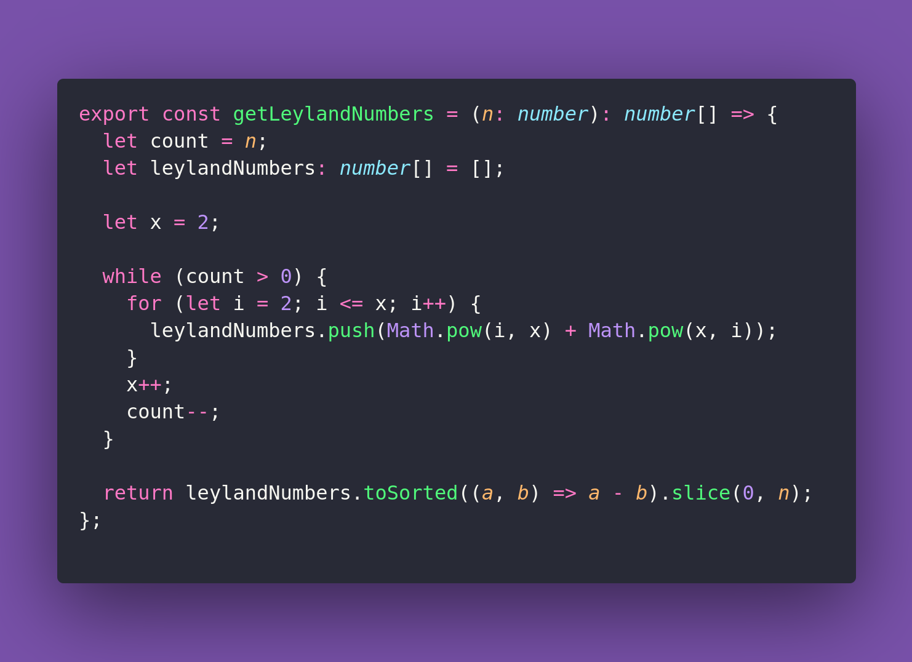

# 8️⃣ Get Leyland Numbers

Interview question of the [issue #399 of rendezvous with cassidoo](https://buttondown.com/cassidoo/archive/8-you-can-have-a-plan-but-you-have-to-be-flexible/).

## The Question

Write a function that returns the first n Leyland numbers in ascending order.
A Leyland number is defined as x^y + y^x for integers x > 1 and y > 1.

### Example

```js
getLeylandNumbers(1)
[8]

getLeylandNumbers(5)
[8, 17, 32, 54, 57]
```

## Solution


