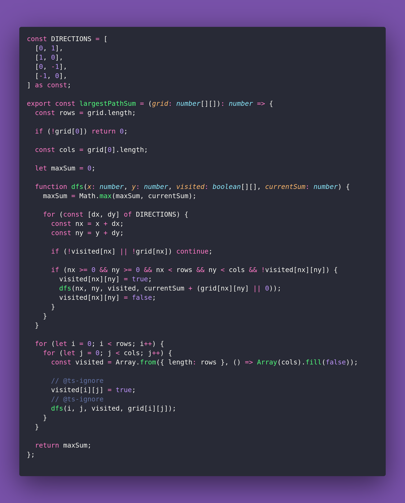

# 🛣️ Largest Path Sum

Interview question of the [issue #400 of rendezvous with cassidoo](https://buttondown.com/cassidoo/archive/of-all-possessions-a-friend-is-the-most-precious/).

## The Question

Given a 2D grid of integers, find the largest sum of any connected path of cells.
A path consists of horizontally or vertically adjacent cells (no diagonals) and cannot reuse cells.
Return the largest sum.

### Example

```js
const grid1 = [
  [1, 2, 3],
  [4, 5, 6],
  [7, 8, 9]
];

const grid2 = [
  [5, 3],
  [2, 8]
];

largestPathSum(grid1)
> 45 // (1 → 2 → 3 → 6 → 9 → 8 → 7 → 4 → 5)

largestPathSum(grid2)
> 18 // (5 → 3 → 8 → 2)
```

## Solution


