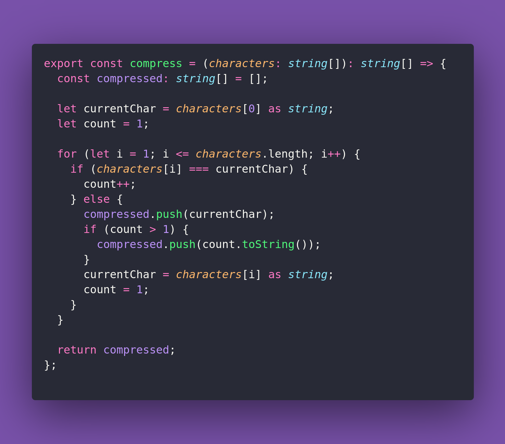

# 👶 Compress

Interview question of the [issue #402 of rendezvous with cassidoo](https://buttondown.com/cassidoo/archive/we-all-have-the-duty-to-do-good-pope-francis/).

## The Question

Given an array of characters chars, compress it such that consecutive duplicate characters are
replaced with the character followed by the count of duplicates. If the count is 1, omit it.

### Example

```js
> compress(["a", "b", "b", "b", "c"])
> ["a", "b", "3", "c"]

> compress(["a", "a", "b", "b", "c", "c", "c"])
> ["a", "2", "b", "2", "c", "3"]
```

## Solution


