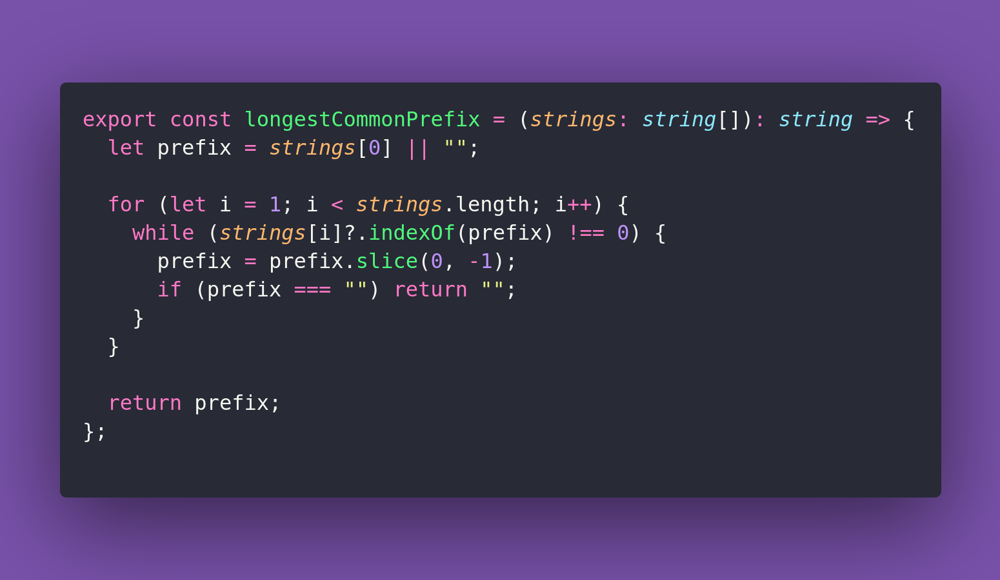

# 🧣 Longest Common Prefix

Interview question of the [issue #403 of rendezvous with cassidoo](https://buttondown.com/cassidoo/archive/be-quick-but-never-hurry-john-wooden/).

## The Question

Write a function that takes a list of strings and returns the longest string that is a prefix of
at least two strings in the list.

### Example

```js
longestCommonPrefix(["flower","flow","flight"])
"fl"

longestCommonPrefix(["dog","racecar","car"])
""

longestCommonPrefix(["interstellar","internet","internal","interval"])
"inte"
```

## Solution


