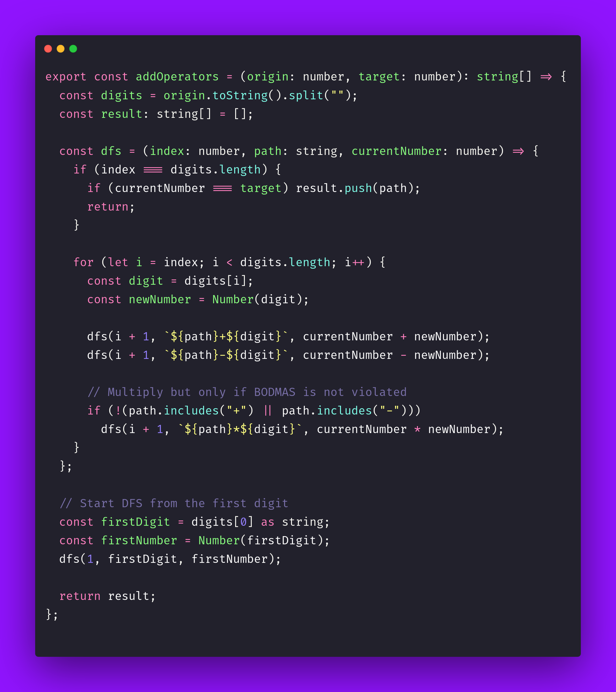

# ➕ Add Operators

Interview question of the [issue #404 of rendezvous with cassidoo](https://buttondown.com/cassidoo/archive/birds-born-in-a-cage-think-flying-is-an-illness/).

## The Question

Given two integers origin and target, add operators in the origin number to make it equal target,
if possible. You can return just one, or all possibilities for this!

### Example

```js
> addOperators(123, 6)
> ["1*2*3", "1+2+3"]

> addOperators(3456237490, 9191)
> [] // none possible
```

## Solution


