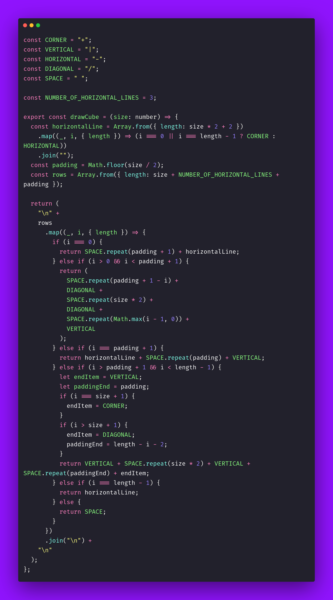

# 🧊 Draw Cube

Interview question of the [issue #405 of rendezvous with cassidoo](https://buttondown.com/cassidoo/archive/imagination-is-more-important-than-knowledge/).

## The Question

Write a function that draws an ASCII art cube of given height n.

### Example

```js
> drawCube(2)
"
  +----+
 /    /|
+----+ |
|    | +
|    |/
+----+
"

> drawCube(4)
"
   +--------+
  /        /|
 /        / |
+--------+  |
|        |  |
|        |  +
|        | /
|        |/
+--------+
"
```

## Solution


