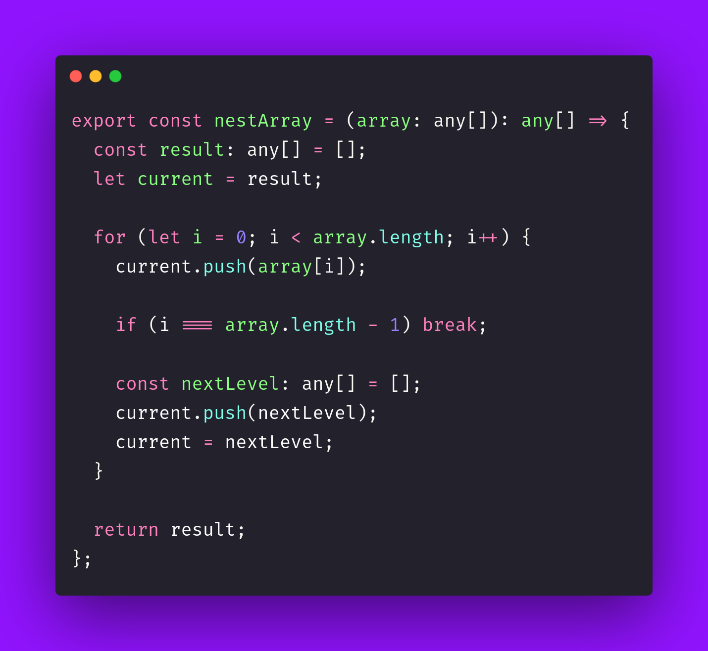

# 🌈 Nest Array

Interview question of the [issue #407 of rendezvous with cassidoo](https://buttondown.com/cassidoo/archive/consistent-actions-produce-results-more-often/).

## The Question

Turn an array of integers into a nested array. You can think of this as the opposite of
flattening an array!

### Example

```js
nestArray([1, 2, 3, 4])
> [1, [2, [3, [4]]]]

nestArray([1])
> [1]
```

## Solution


