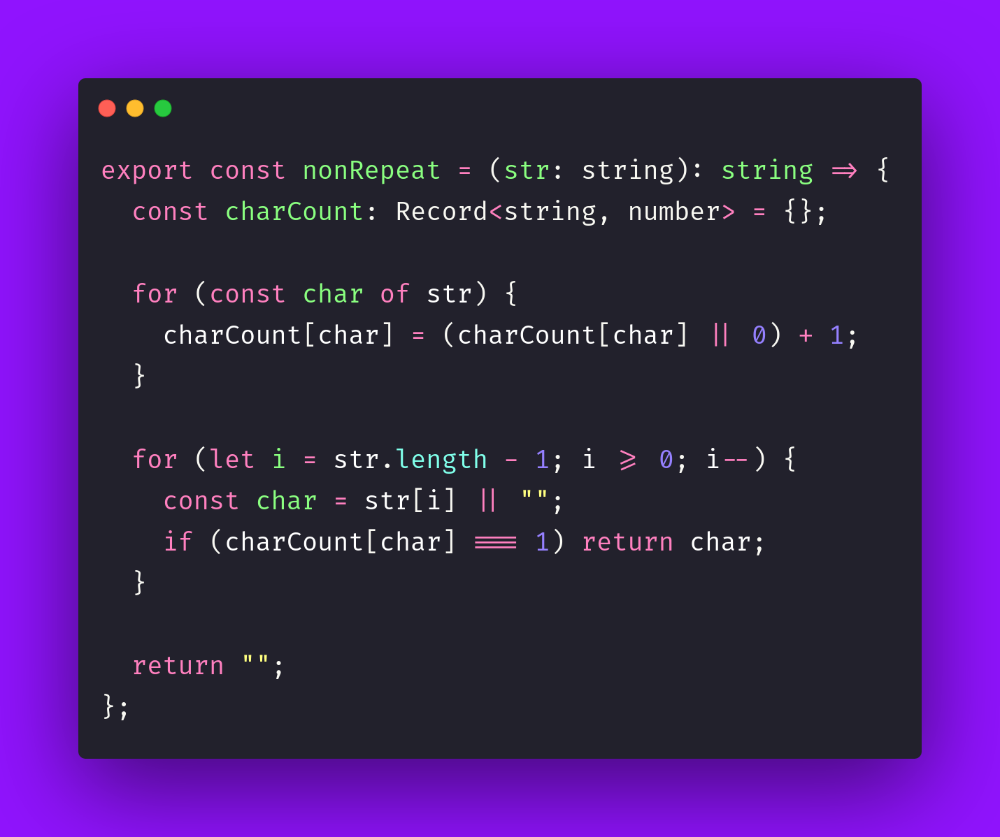

# 🔁 Non Repeat

Interview question of the [issue #411 of rendezvous with cassidoo](https://buttondown.com/cassidoo/archive/it-takes-courage-to-grow-up-and-become-who-you/).

## The Question

Find the last non-repeating character in a given string. If all characters repeat, return an empty string.

### Example

```js
> nonRepeat('candy canes do taste yummy')
> 'u'
```

## Solution


