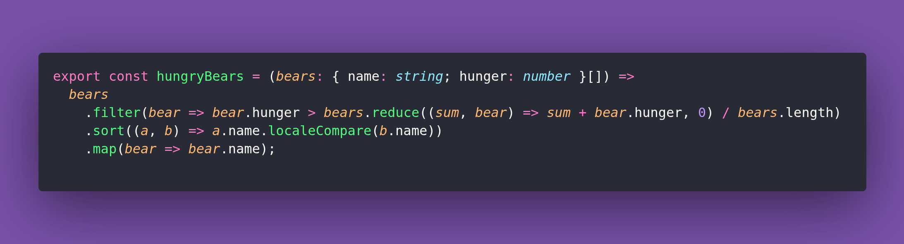

# 🐻 Hungry Bears

Interview question of the [issue #430 of rendezvous with cassidoo](https://buttondown.com/cassidoo/archive/the-future-is-sending-back-good-wishes-and/).

## The Question

Given an array of objects representing bears in a forest, each with a name and hunger level, return the names of all bears whose hunger level is above the forest average, sorted alphabetically. In how few lines can you do this one?

### Example

```js
const bears = [
  { name: 'Baloo', hunger: 6 },
  { name: 'Yogi', hunger: 9 },
  { name: 'Paddington', hunger: 4 },
  { name: 'Winnie', hunger: 10 },
  { name: 'Chicago', hunger: 20 },
];

hungryBears(bears)
> ['Chicago', 'Winnie']
```

## Solution


