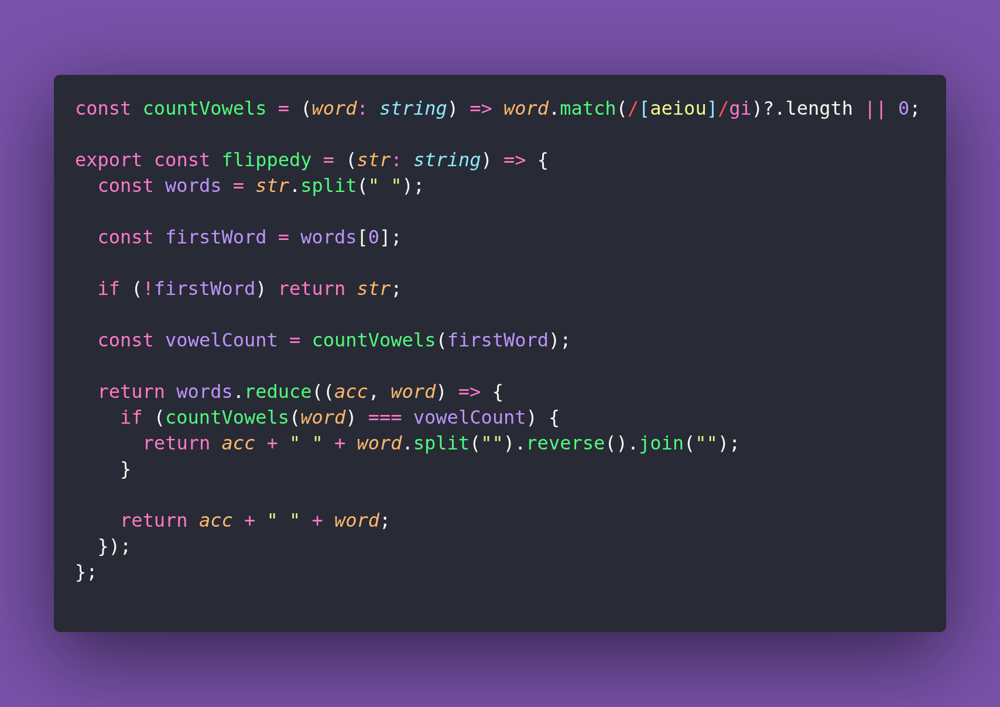

# 🎏 Flippedy

Interview question of the [issue #441 of rendezvous with cassidoo](https://buttondown.com/cassidoo/archive/happiness-is-a-choice-that-requires-effort-at/).

## The Question

You are given a string consisting of lowercase words, each separated by a single space. Determine how many vowels appear in the first word. Then, reverse each following word that has the same vowel count.

### Example

```js
flippedy("cat and mice")
> "cat dna mice"

flippedy("banana healthy")
> "banana healthy"
```

## Solution


